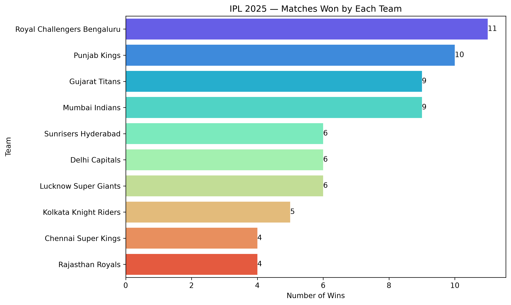
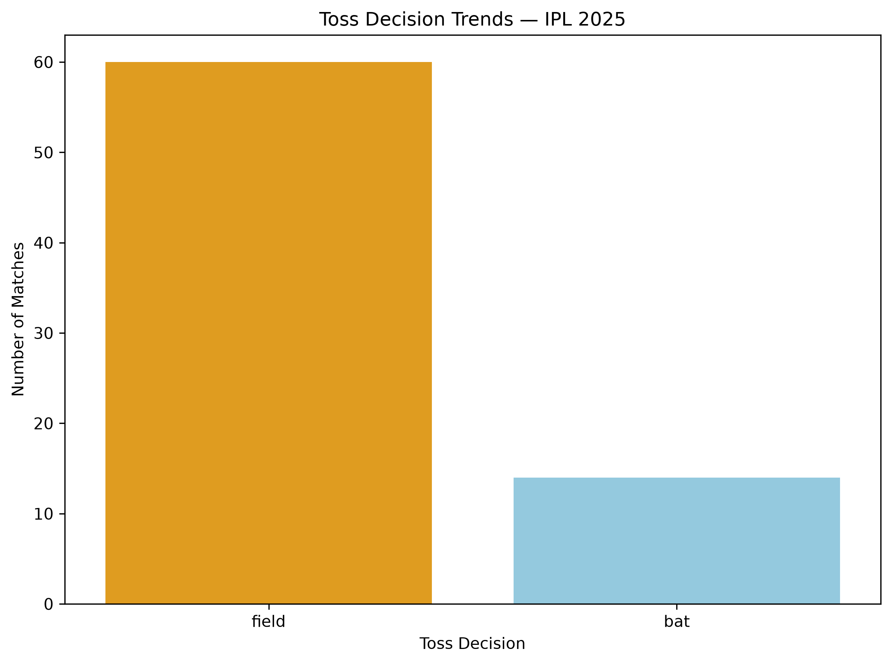
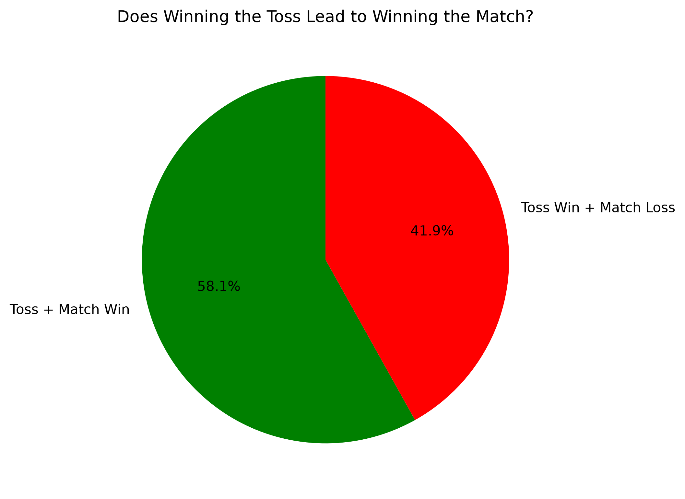
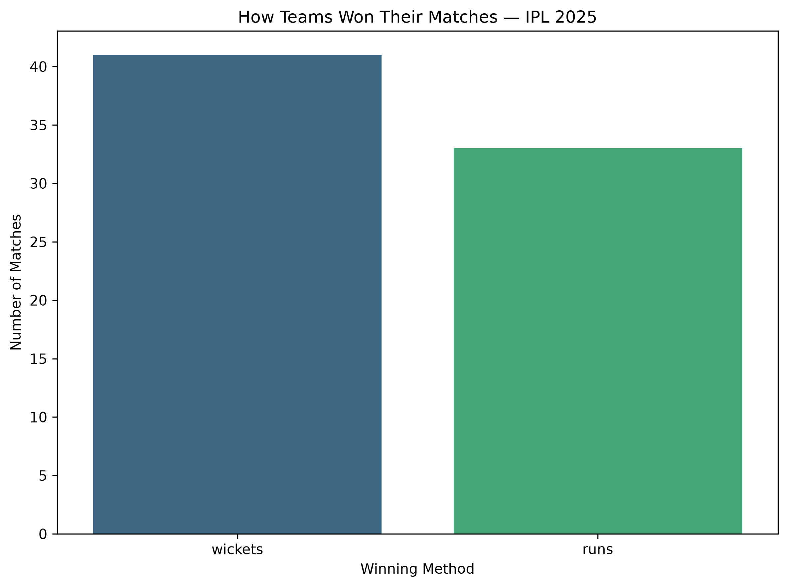
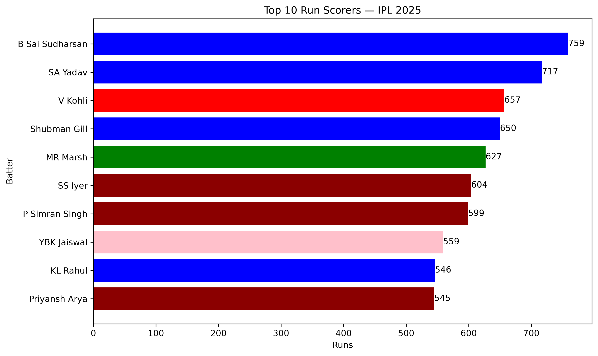
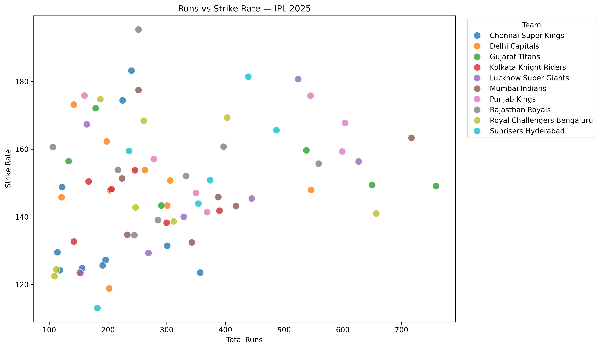
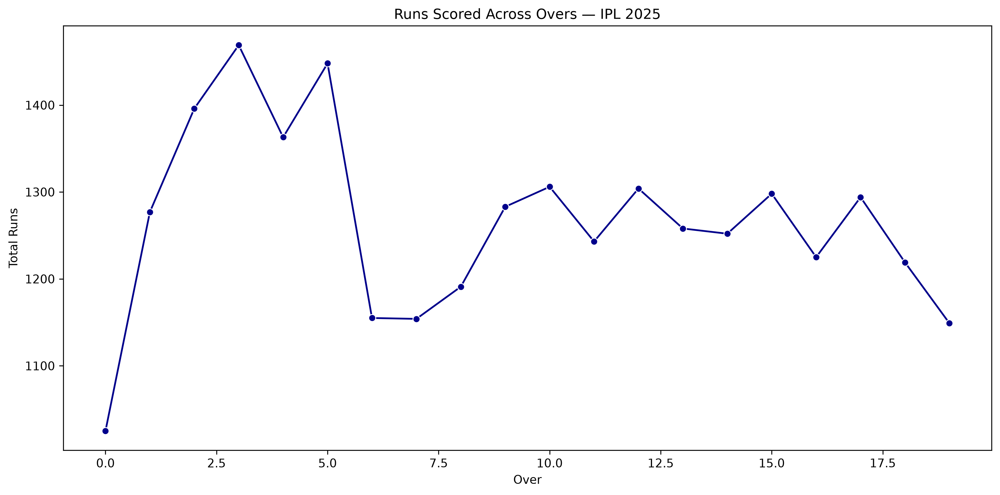
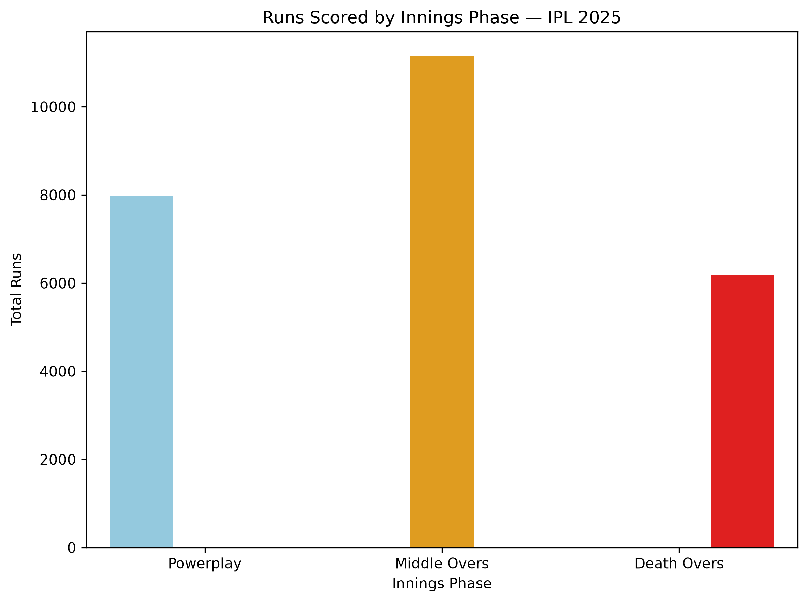

# 🏏 IPL 2025 Analysis

A data analysis and visualization project exploring the Indian Premier League (IPL) 2025 using Python, Pandas, Matplotlib, and Seaborn.

The project uses ball-by-ball IPL data to analyze team performance, toss decisions, match outcomes, batting performance, strike rates, scoring patterns, and innings phases.

---

## 🎯 Project Objective

The goal of this project is to explore IPL 2025 data and answer meaningful cricket-related questions through data analysis and visualization.

The analysis focuses on:

- Team performance
- Toss decisions
- Impact of winning the toss
- Match-winning methods
- Batting performance
- Runs vs Strike Rate
- Scoring patterns across overs
- Powerplay, Middle Overs, and Death Overs

---

## 🛠️ Technologies Used

- Python
- Pandas
- Matplotlib
- Seaborn

---

## 📂 Dataset

The project uses a ball-by-ball IPL dataset stored in:

`iplall.csv`

The dataset is loaded using Pandas and filtered to extract IPL 2025 data.

Key information used includes:

- Match ID
- Season
- Teams
- Winner
- Toss Winner
- Toss Decision
- Batter
- Batting Team
- Runs Scored
- Over
- Match Result

---

# 📊 Analysis & Visualizations

## 1. Teams with the Most Wins

The project calculates the number of matches won by each team during IPL 2025.

### Question

**Which teams had the most wins in IPL 2025?**



---

## 2. Toss Decision Trends

The project analyzes what teams chose after winning the toss.

Possible decisions include:

- Bat
- Field

### Question

**What did teams choose after winning the toss?**



---

## 3. Does Winning the Toss Lead to Winning the Match?

The project compares whether the team winning the toss also went on to win the match.

### Question

**Does winning the toss lead to winning the match?**



---

## 4. How Teams Won Their Matches

The project analyzes the match result to understand the different ways teams won their matches.

### Question

**How did teams win their matches?**



---

## 5. Top 10 Run Scorers

The project calculates total runs scored by each batter and identifies the top 10 run scorers of IPL 2025.

### Question

**Who were the top run scorers of IPL 2025?**



---

## 6. Runs vs Strike Rate

Player statistics are calculated using:

- Total runs
- Total balls
- Strike rate

**Strike Rate = (Runs / Balls) × 100**

Only players with at least 100 runs are included to focus on meaningful batting contributions.

### Question

**How does a batter's scoring volume relate to their strike rate?**



---

## 7. Runs Scored Across Overs

The project calculates the total runs scored in each over across IPL 2025 matches.

A line graph is used to visualize how scoring changes throughout an innings.

### Question

**How does scoring change across the innings?**



---

## 8. Powerplay vs Middle Overs vs Death Overs

The innings are divided into three phases:

- **Powerplay:** Overs 1–6
- **Middle Overs:** Overs 7–15
- **Death Overs:** Overs 16–20

The project calculates the total runs scored during each phase.

### Question

**Which phase of an innings produces the most runs?**



---

# 📈 Visualization Summary

| Analysis | Visualization |
|---|---|
| Team Wins | Bar Chart |
| Toss Decisions | Bar Chart |
| Toss Impact | Pie Chart |
| Winning Methods | Bar Chart |
| Top 10 Run Scorers | Bar Chart |
| Runs vs Strike Rate | Scatter Plot |
| Runs Across Overs | Line Graph |
| Innings Phases | Bar Chart |

---

# 🧠 Data Analysis Concepts Used

This project demonstrates practical use of:

- Data loading with Pandas
- Data filtering
- Data cleaning
- `groupby()`
- `value_counts()`
- `agg()`
- `sort_values()`
- `head()`
- `nunique()`
- Conditional filtering
- Creating derived columns
- `pd.cut()`
- Data aggregation

### Visualization Techniques

- Bar charts
- Line charts
- Pie charts
- Scatter plots
- Seaborn statistical visualizations

---

# 📁 Project Structure

```text
ipl-2025-analysis/
│
├── iplall.csv
├── ipl_2025_analysis.py
│
├── screenshots/
│   ├── innings_phase.png
│   ├── runs_across_overs.png
│   ├── runs_vs_strikerate.png
│   ├── team_wins.png
│   ├── top_run_scorers.png
│   ├── toss_decision.png
│   ├── toss_impact.png
│   └── winning_method.png
│
└── README.md
