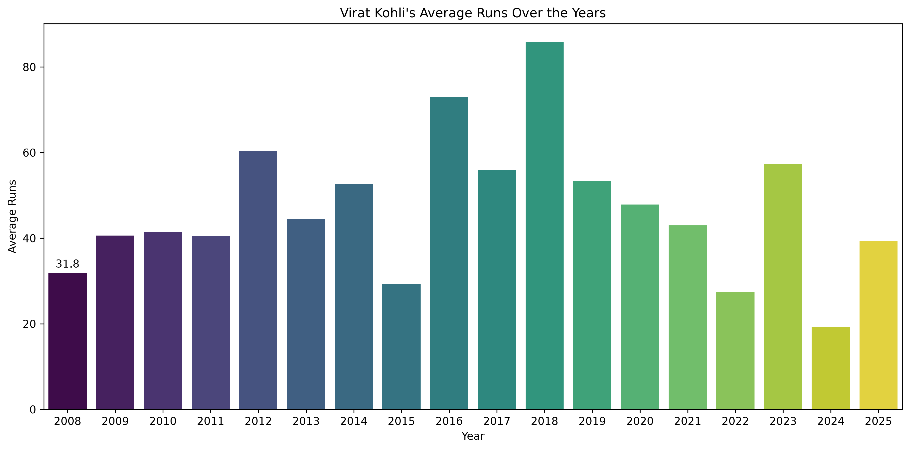
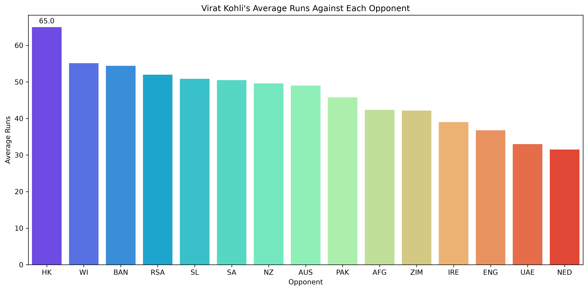
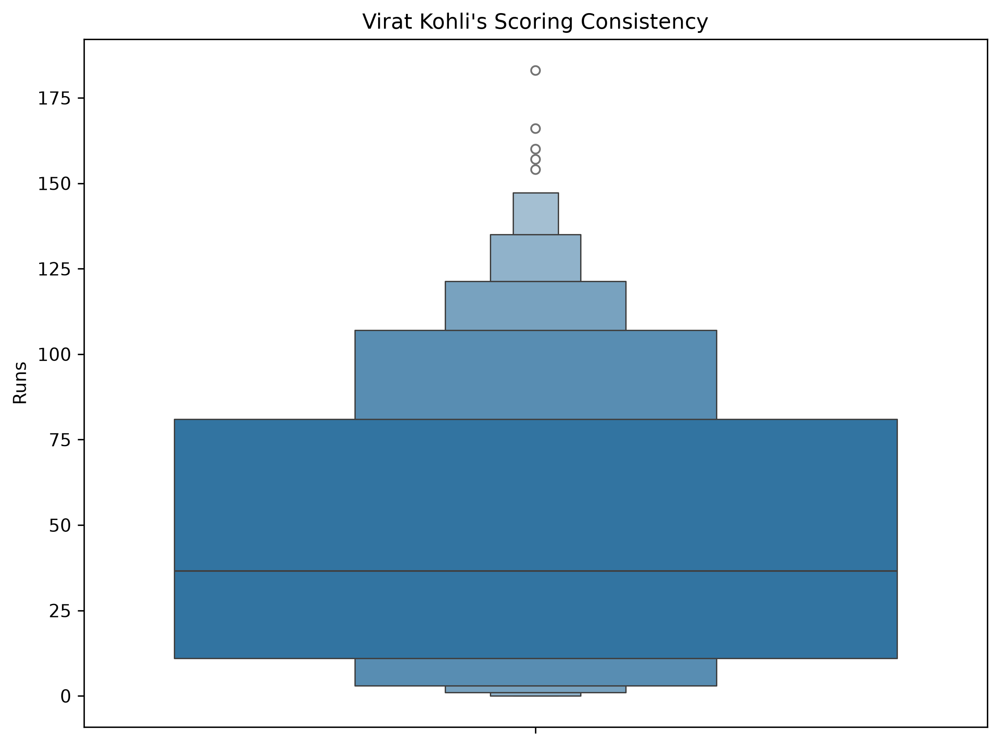
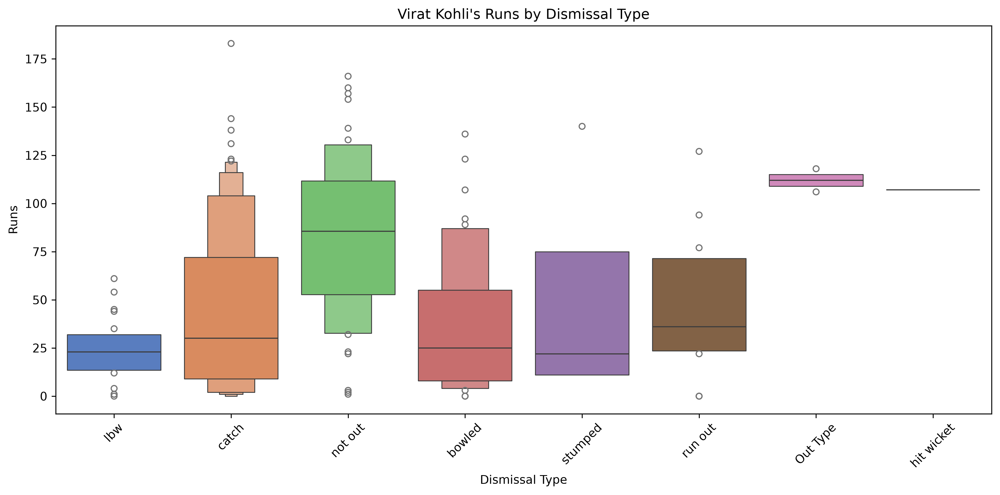
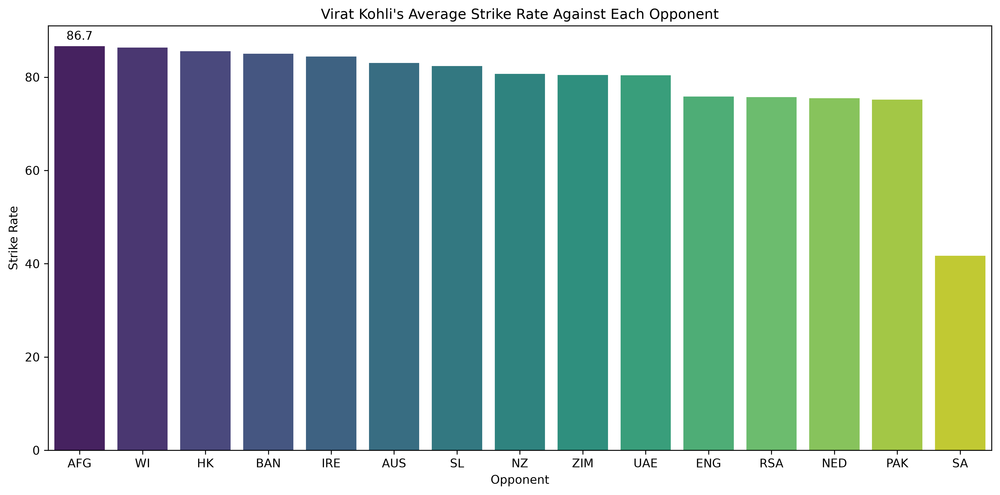
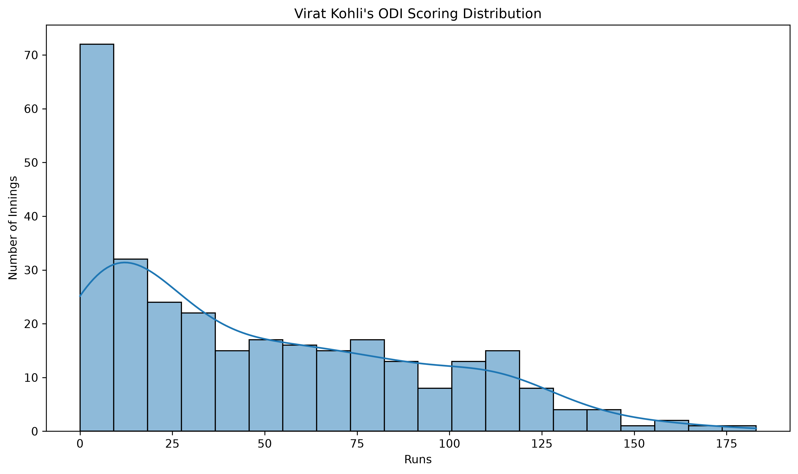
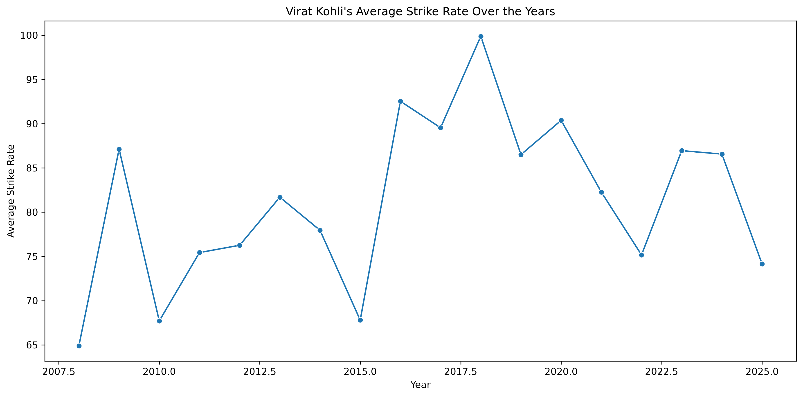
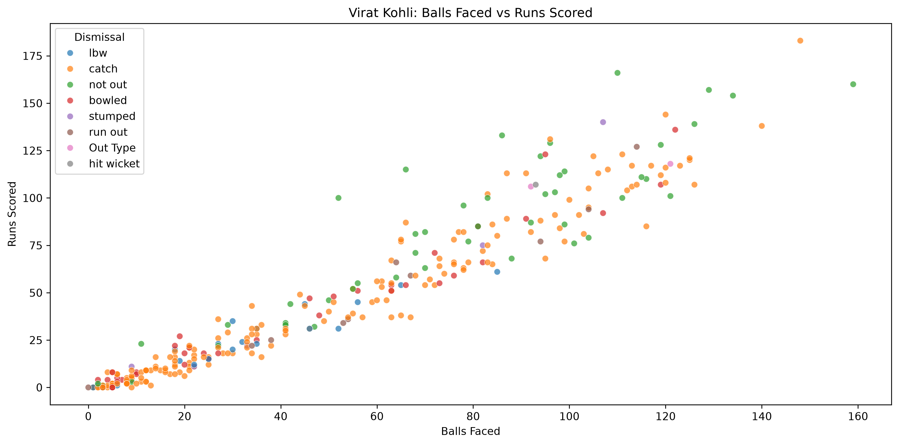

# 🏏 Virat Kohli ODI Career Analysis

An exploratory data analysis project focused on analyzing Virat Kohli's ODI batting performance using Python, Pandas, Matplotlib, and Seaborn.

## 📌 Project Overview

This project analyzes Virat Kohli's ODI batting data to understand his scoring patterns, consistency, strike rate, performance against different opponents, and the relationship between runs scored and balls faced.

The project includes data cleaning, transformation, statistical analysis, and data visualization.

## 🛠️ Technologies Used

- Python
- Pandas
- Matplotlib
- Seaborn

## 🧹 Data Cleaning & Transformation

The dataset was processed using Pandas to:

- Extract runs and balls faced from the `Run` column
- Convert match dates into datetime format
- Extract the year from match dates
- Extract opponents from the match information
- Prepare the data for statistical analysis and visualization

## 📊 Analysis Performed

The project explores:

1. Average runs scored over the years
2. Average runs against each opponent
3. Scoring consistency
4. Runs by dismissal type
5. Average strike rate against each opponent
6. ODI scoring distribution
7. Average strike rate over the years
8. Relationship between balls faced and runs scored

## 📈 Visualizations

### 1. Average Runs Over the Years



### 2. Average Runs Against Each Opponent



### 3. Scoring Consistency



### 4. Runs by Dismissal Type



### 5. Average Strike Rate Against Each Opponent



### 6. ODI Scoring Distribution



### 7. Average Strike Rate Over the Years



### 8. Balls Faced vs Runs Scored



## 🔍 Key Learning Outcomes

Through this project, I practiced:

- Data cleaning with Pandas
- Data transformation
- GroupBy and aggregation
- Statistical analysis
- Working with datetime data
- Extracting information using regular expressions
- Data visualization with Matplotlib
- Advanced visualization techniques with Seaborn
- Interpreting cricket performance data

## ▶️ How to Run

Clone the repository and navigate to the project folder.

Install the required libraries:

```bash
pip install pandas matplotlib seaborn
